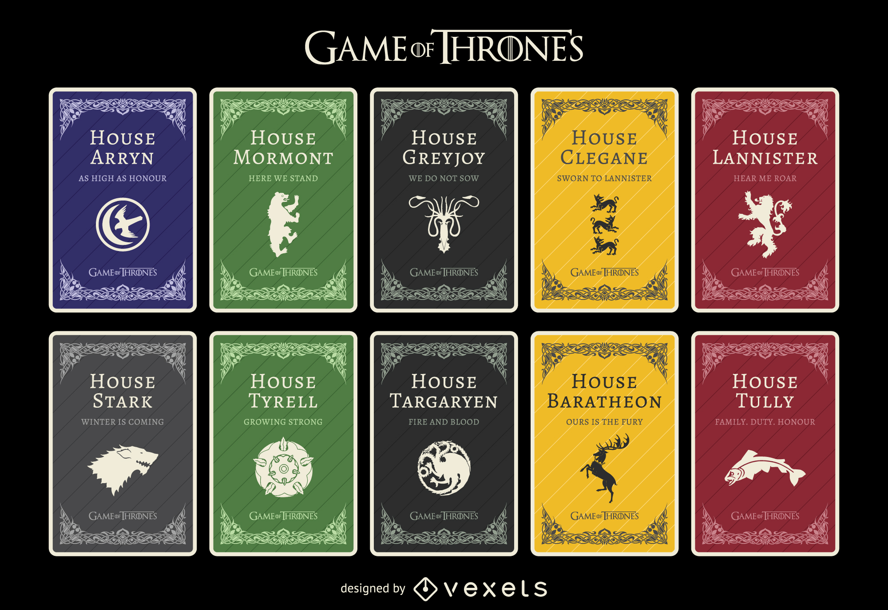
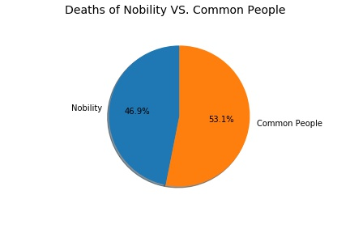
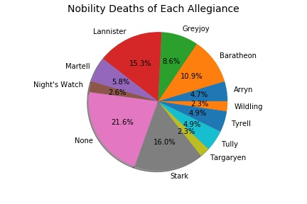
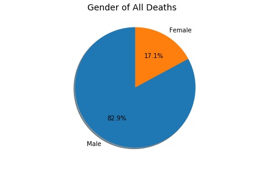
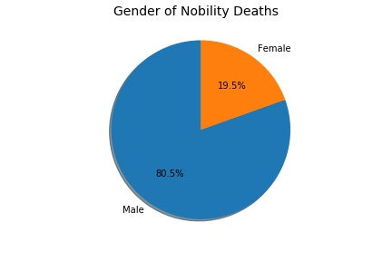
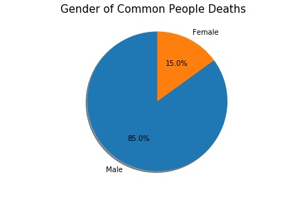
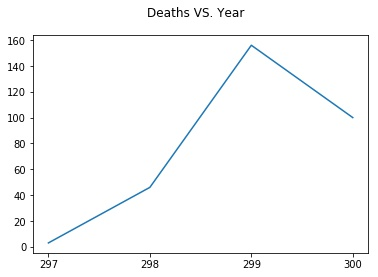

# Data Visualization for Game of Thrones Character Deaths

Yixin Zhang

**Did you watch the new episode last night?**

I won't be the spoiler: data only contains the first 5 seasons!

---

### Brief intro
1. Data
  * Source: [Kaggle](https://www.kaggle.com/mylesoneill/game-of-thrones)
  * License: [Public Domain](https://creativecommons.org/publicdomain/zero/1.0/), no copyright
  * Based on books (Season 1-5)
  * Preprocessed
2. Images
  * Downloaded from [Vexels](https://www.vexels.com/vectors/preview/78080/game-of-thrones-houses)
  * Downloaded from [Pinterest](https://www.pinterest.com/pin/221450506656593446/)
3. Frameworks
  * matplotlib
  * vega-lite

---

### Houses

** A [story map](http://viewers-guide.hbo.com/game-of-thrones/season-1/episode-1/map/location/68/volantis-free-city) for season 1 **

<html>
<head>

</head>
<body>

  

    
  

</body>
</html>

---

<html>
<head>

</head>
<body>

<h2>Summary of Nobility</h2>

Mentioned deaths of nobility and common people are almost same.

  

    
  

  

    
  

</body>
</html>

---

<html>
<head>

</head>
<body>

<h2>gender of deaths</h2>

Gender distribution for nobility and common people is almost the same.

  

    
  

  

    
  

  

    
  

</body>
</html>

---

### Deaths in Each Year

|   Year   |     Deaths    |  
|----------|:-------------:|
| 297      |  3            |
| 298      |    46  |
| 299 | 156 |
|300|100|
|Unknown|612|

** In the following, unknown year is set to 301 and unknown book/chapter is set to 0. ** 

<html>
<head>

</head>
<body>

  

    
  

</body>
</html>
