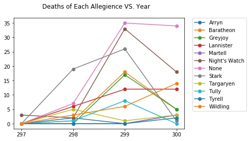
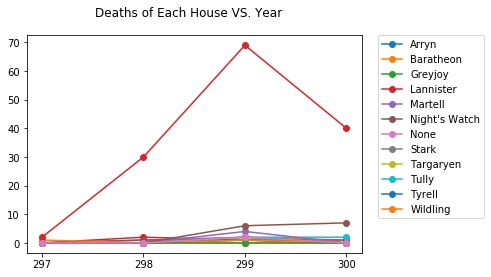
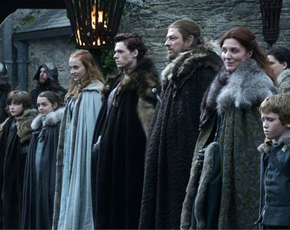

### Relationship of Deaths of Each Allegience with Year

<html>
<head>

</head>
<body>

  

    
  

</body>
</html>

---

### Deaths of each house VS. Years

<body>

  

    
  

---

### Nobility, Death Year, Book of Death

 Many Starks, common people and night's watch died in Book 3 and Year 299. 

---

### Important battles mentioned

---

### Preview video of final season

<!-- .slide: data-background-iframe="https://www.youtube.com/embed/rlR4PJn8b8I" data-background-interactive -->

---

### Q & A

 Thank you! 

 Stark family in S1 E1, from Pinterest 

<body>

  

    
  

</body>